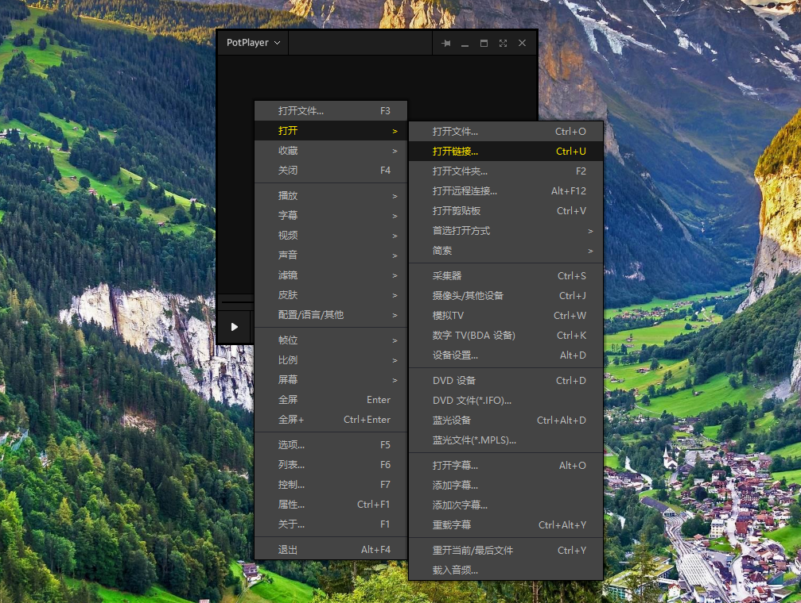
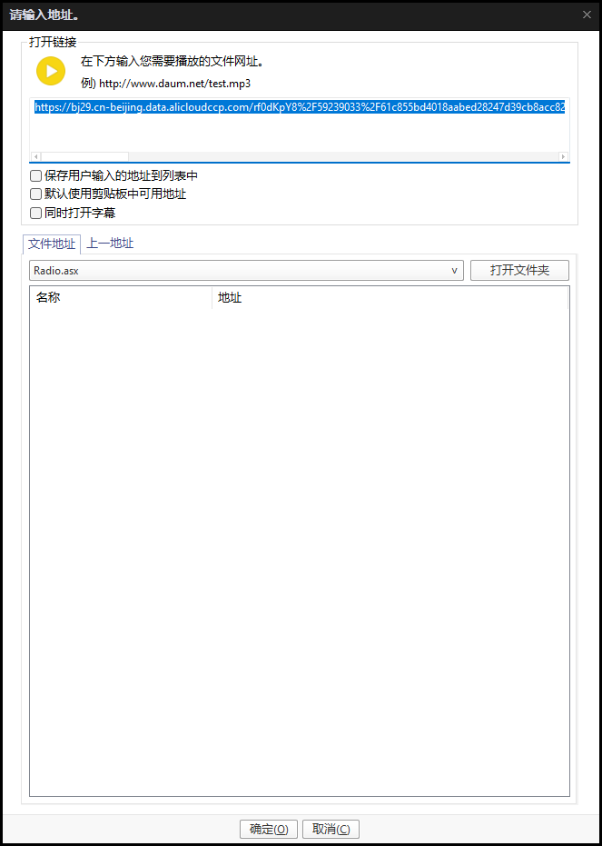

# AliyunDrive

PotPlayer 在线播放阿里云盘视频外链

## 前提

在网页上获取外链，点击安装 tampermonkey 脚本 [阿里云盘](https://greasyfork.org/zh-CN/scripts/425955-%E9%98%BF%E9%87%8C%E4%BA%91%E7%9B%98)（支持提取阿里云盘外链的脚本不止一个，这个只是我常用的）

## 使用

- 下载此 repo
- 解压
- 将 Media 文件夹复制到 `c:\Program Files\DAUM\PotPlayer\Extension\` 或 `{PotPlayer_Folder}\Extension\`

然后直接使用 PotPlayer 打开链接(`Ctrl + U`)的功能播放外链即可




目前只支持链接域名

- `bj29.cn-beijing.data.alicloudccp.com`
- `cn-beijing-data.aliyundrive.net`

## TODO

- [ ] 研究下 Potplayer 是否允许插件添加自己的配置，便于添加其他域名

## 如何实现

添加如下 http 请求头，使用任意支持添加 http 头的下载工具都可以下载

```http
User-Agent: Mozilla/5.0 (Windows NT 10.0; Win64; x64) AppleWebKit/537.36 (KHTML, like Gecko) Chrome/99.0.4844.74 Safari/537.36 Edg/99.0.1150.55
Referer: https://www.aliyundrive.com/
```
